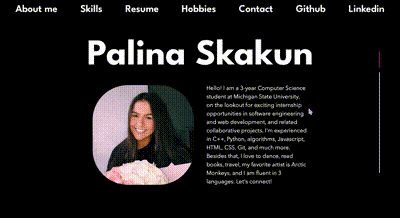

# Palina Skakun Portfolio

Welcome to my personal portfolio website! This repository contains the source code for my portfolio showcasing my skills, experience, and projects. Feel free to explore and learn more about me.

## Table of Contents
- [Introduction](#introduction)
- [Skills](#skills)
- [Resume](#resume)
- [Hobbies & Involvement](#hobbies--involvement)
- [Contact](#contact)

## Introduction
The website is built using HTML, CSS, and JavaScript. It utilizes Bootstrap for styling and FullPage.js for creating a smooth, interactive scrolling experience. The font used is League Spartan, and you can find the link to it in the head section of the HTML.

## Video Walkthrough

Here's a walkthrough of implemented features:

GIF created with FreeConvert https://www.freeconvert.com

### Navigation
The website has a navigation bar that allows you to jump to different sections:
- About me
- Skills
- Resume
- Hobbies
- Contact
- External links to my [GitHub](https://github.com/palinaskakun) and [LinkedIn](https://www.linkedin.com/in/palinaskakun/)

## Skills
I have listed my technical skills and proficiency levels in various programming languages, tools, and languages. The skills are categorized for better organization and readability.

## Resume
The "Resume" section provides an overview of my professional experience, including details about my current and past roles. You can also find a link to download my complete CV.

## Hobbies & Involvement
Learn more about my personal interests, hobbies, and involvement in various clubs and activities. The section includes icons representing my hobbies and images related to my interests.

## Contact
Feel free to reach out to me! The "Let's Connect!" section includes a contact form where you can input your name, email, and message to get in touch with me. Additionally, you can connect with me on various social platforms like LinkedIn, GitHub, Instagram, and via email.

## Usage
1. Clone the repository: `git clone https://github.com/palinaskakun/your-portfolio-repo.git`
2. Open the `index.html` file in your web browser.

## Credits
- [Bootstrap](https://getbootstrap.com/)
- [FullPage.js](https://alvarotrigo.com/fullPage/)
- Icons sourced from [Flaticon](https://www.flaticon.com/)

Feel free to customize the website for your use and add your own projects and experiences. All the best!
